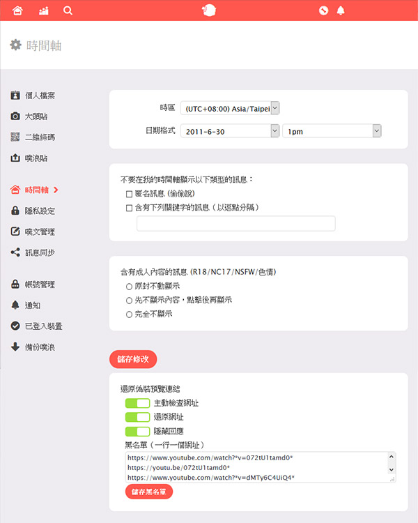

# 還原在噗浪上的偽裝預覽連結

由於近期各種偽造預覽，實質導向統神端火鍋影片的連結充斥噗浪，於是寫了簡單的工具讓網址現出原形。

## 安裝腳本

*必須先在瀏覽器安裝腳本管理工具，例如 [Tampermonkey](https://www.tampermonkey.net/)。*

前往 [recover_fake_preview.user.js](./recover_fake_preview.user.js) 並開啟原始碼（按下程式碼上方的 Raw 按鈕），腳本管理工具會自動詢問是否進行安裝；或是可以複製程式後自行在腳本管理工具中新增腳本。

## 使用方式

安裝後進入[時間軸設定頁面](https://www.plurk.com/settings/timeline)，將要封鎖的網址輸入黑名單中並按下*儲存黑名單*。

黑名單網址設定支援星號萬用字元（*）。

## 注意事項

黑名單無法跨裝置生效。
